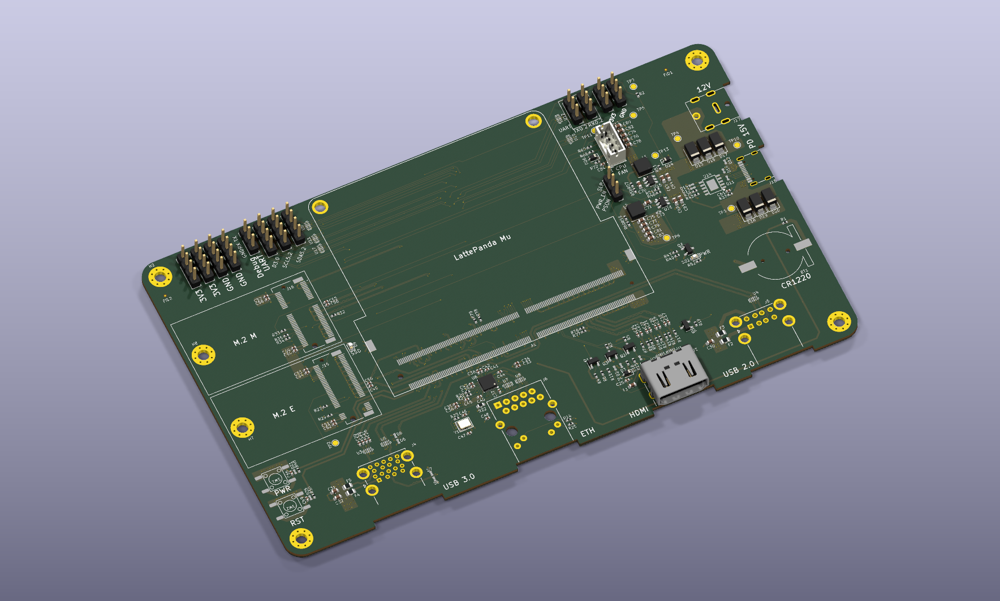

# LattePanda Mu Carrier Board

A custom 4-layer carrier board for the **LattePanda Mu** x86 compute module (Intel N100 / N305), designed in KiCad. The module supplies the CPU, RAM and storage; this board turns its 260-pin edge connector into real-world I/O with Gigabit Ethernet, HDMI, USB 2.0/3.0, two M.2 slots, GPIO/I²C/UART headers, PWM fan control, and a dual-input power supply.



*3D render from the current KiCad source*

---

## Board at a glance

| | |
|---|---|
| **Outline** | 170.1 × 100.1 mm, 8 mounting holes (M3 + M2), 2 fiducials |
| **Stackup** | 4 layers — `F.Cu` / `In1.GND` / `In2.PWR` / `B.Cu`, 1.606 mm, FR4 εr 4.5, impedance-controlled |
| **Power in** | 12 V barrel jack **or** USB-C PD (CH224K negotiates 15 V) — diode-ORed onto a common `VDC` rail |
| **Rails** | `VDC` → 2× LM2734X buck → **+5V**, **+3V3**; **+1V0** local to the Ethernet PHY; **+BATT** from a CR1220 for the module RTC |
| **Ethernet** | RTL8111H-CG GbE controller on a PCIe x1 link, RJ45 with integrated magnetics |
| **Display** | HDMI Type-A, driven from the module's `DDI_B` port |
| **USB** | 2× USB 3.0 Type-A (stacked), 2× USB 2.0 Type-A (stacked), 1× USB-C (**power only**) |
| **M.2** | M-key (PCIe x1, NVMe) + E-key (PCIe x1 + USB 2.0, Wi-Fi/BT) |
| **Expansion** | PCIe x4 slot — fully designed, **not populated** in this revision |
| **Misc** | 4-pin PWM/tach fan header, power + reset buttons, debug UART, 13 test points (10 populated) |
| **Size of the job** | 217 placed footprints, 354 nets, 680 vias, 9 hierarchical sheets |

Full parts list: [`LattePandaMu_carrier_custom.csv`](LattePandaMu_carrier_custom.csv).

---

## Where the high-speed lanes go

| Module resource | Spent on | Notes |
|---|---|---|
| `HSIO_0` TX/RX | USB 3.0 port 1 SuperSpeed | TX AC-coupled (C26/C27) |
| `HSIO_1` TX/RX | USB 3.0 port 2 SuperSpeed | TX AC-coupled (C28/C29) |
| `HSIO_2` + `REFCLK0` | M.2 **M**-key — PCIe x1 | TX AC-coupled (C49/C50) |
| `HSIO_3` + `REFCLK3` | M.2 **E**-key — PCIe x1 | TX AC-coupled (C55/C56) |
| Dedicated GbE PCIe pair + clock | RTL8111H | AC-coupled (C38/C39/C42/C43) |
| `HSIO_8` – `HSIO_11` | *reserved* for the PCIe x4 slot | currently unrouted (slot is DNP) |
| `DDI_B_TX0..3` | HDMI TMDS | AC-coupled, ESD arrays U1/U2 |
| `USB2_P1/2/3/5` | 4× USB Type-A ports | |
| `USB2_P7` | M.2 E-key | Bluetooth on a combo card |
| `USB2_P4/6/8` | unused | |

AC coupling appears on **TX pairs only** — the far-end receiver provides its own caps, per PCIe and USB 3.0 convention.

---

## Schematic hierarchy

| Sheet | File | Contents |
|---|---|---|
| LattePanda Module | [`LattePanda_Module.kicad_sch`](LattePanda_Module.kicad_sch) | 260-pin module connector and all lane fan-out |
| Power Supply | [`psu.kicad_sch`](psu.kicad_sch) | DC jack, USB-C PD (CH224K), ORing, 2× buck, power sequencing |
| Gigabit Ethernet | [`ethernet.kicad_sch`](ethernet.kicad_sch) | RTL8111H, 25 MHz crystal, MDI pairs, RJ45 |
| HDMI | [`hdmi.kicad_sch`](hdmi.kicad_sch) | DDI_B → TMDS, ESD protection, fused +5 V |
| USB 2.0 & 3.0 | [`usb_2_3.kicad_sch`](usb_2_3.kicad_sch) | Stacked A-connectors, per-port fusing, ESD |
| M.2 M Key | [`m2_em_key.kicad_sch`](m2_em_key.kicad_sch) | Both the M-key and E-key sockets |
| PCIe x4 | [`pciex4.kicad_sch`](pciex4.kicad_sch) | x4 slot + AC caps — all DNP |
| GPIO | [`gpio.kicad_sch`](gpio.kicad_sch) | 4× I²C, 3× UART, 4× GPP headers |
| Fan | [`fan.kicad_sch`](fan.kicad_sch) | 4-pin PWM fan header and drive |

---

## Design rules

Net classes are pattern-assigned in the project file, so a net gets the right geometry from its name:

| Class | Applies to | Track / diff-pair geometry |
|---|---|---|
| `100Ω` | `*MDI*` (Ethernet magnetics side) | 0.144 mm width / 0.100 mm gap |
| `90Ω` | USB 2.0/3.0, PCIe, HSIO, TMDS, REFCLK | 0.199 mm width / 0.099 mm gap |
| `PWR` | `*+*V*` rails | 0.3 mm track, 0.2 mm clearance |
| `Default` | everything else | 0.15 mm track |

Board minimums: 0.14 mm track, 0.2 mm via / 0.2 mm hole, 0.1 mm annular ring, 0.2 mm copper-to-edge.

---

## Repository layout

```
.
├── LattePandaMu_carrier_custom.kicad_pro   # open this in KiCad
├── LattePandaMu_carrier_custom.kicad_pcb   # 4-layer layout
├── LattePandaMu_carrier_custom.kicad_sch   # root hierarchical schematic
├── LattePandaMu_carrier_custom.kicad_dru   # custom design rules
├── LattePandaMu_carrier_custom.csv         # BOM export
├── *.kicad_sch                             # sub-sheets (table above)
├── sym-lib-table / fp-lib-table            # project-scoped, ${KIPRJMOD}-relative
├── Libraries/                              # custom symbols and footprints
├── Assembly/                               # pick-and-place (top / bottom)
├── docs/                                   # renders and documentation images
```

---

## Getting started

1. Install **KiCad 10 or newer** <https://www.kicad.org/download/>.
2. Clone the repository:
   ```bash
   git clone https://github.com/noahbean33/latte_panda_mu.git
   ```
3. Open `LattePandaMu_carrier_custom.kicad_pro`. The library tables are `${KIPRJMOD}`-relative, so `Libraries/` is picked up with no global install.
4. Descend into sub-sheets from the root schematic; open the PCB editor for the layout.

Re-run the checks yourself:

```bash
kicad-cli sch erc --format json -o erc.json LattePandaMu_carrier_custom.kicad_sch
```

```bash
kicad-cli pcb drc --format json -o drc.json LattePandaMu_carrier_custom.kicad_pcb
```

---
